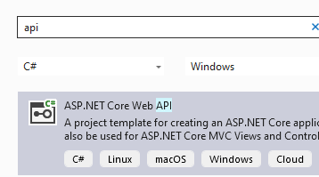
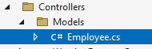
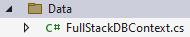
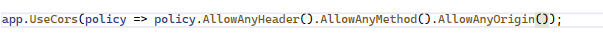
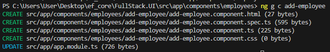
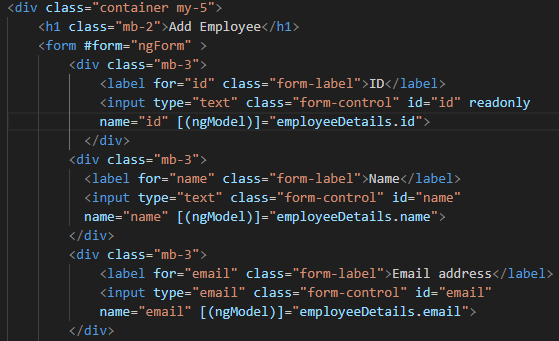

<html><body class="c7 doc-content">

SECP3106-01 

PEMBANGUNAN APLIKASI (WBL) 

APPLICATION DEVELOPMENT (WBL)

SINGTHAI SRISOI

A20EC0147

This report is the step of building an application having CRUD function using EF core and Angular. The application we are building here is an employee management system. Bellow are the steps.

Check if dotnet and Angular is installed.

build a new Angular project named FullStack.UI

start the server

Edit app.component.html file to something we desire. Customize the navigation bar.

import bootstrap

create component employee-list

Add route

Add an interface called employee, storing the details of an employee.

Create some data for testing purpose.

Now we are going to work on the API. API connects the UI and the database using HTTP methods. Create a new file called FullStack.API for the API.

Create a new folder called Models and add a new class called Employee

Create a folder Data, add a new class FullStackDBContext.cs

Add a connection string and add migration.

Update the database

Add MVC Controller - Empty

Add a HTTP get method to get all employee.

Add a HTTP post method for adding employee

Generate a service on Angular.

Add API Url on the environment.

Add get all employee method

Check if it works.

Debug allowing the access from other route to the API

Print all employee.

Generate new component add-employee

Add route

Add form for adding employee.

Add add employee method

Generate edit employee component.

Copy the form from add employee and modify it as they are almost the same.

Add Http get method to retrieve single employee data.

Add get employee method at employee service and add it in the component

Add the value of the employee on the edit form. The id field should be readonly.

Add http put method to update the employee data.

Add update employee method &nbsp;at employee service and add it in the component

Add delete employee method using http delete.

Add delete method &nbsp;at employee service and add it in the component

Add button

The final Edit form

</body></html>